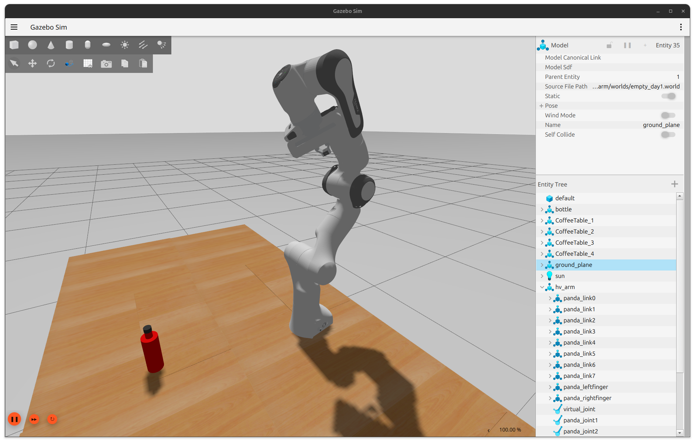
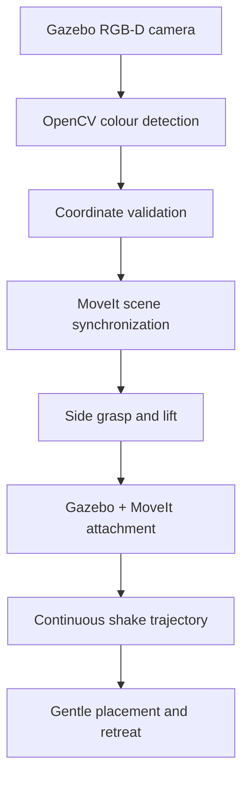
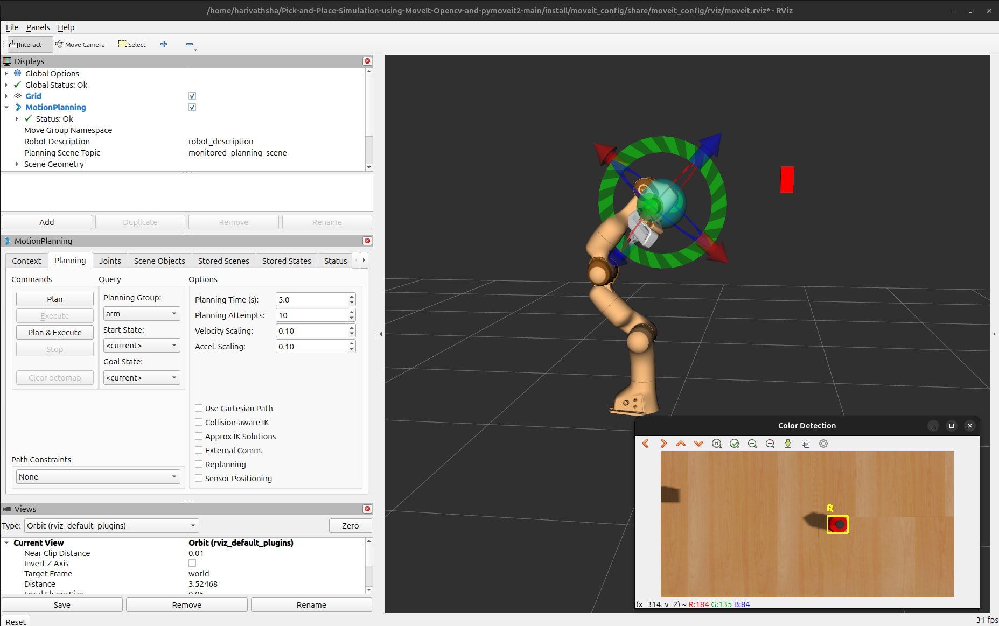
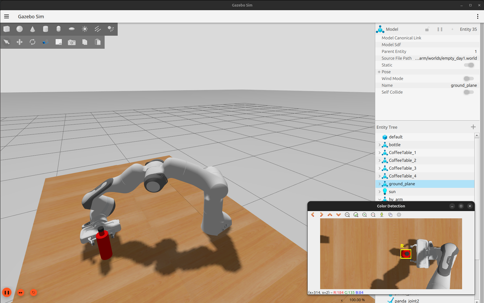
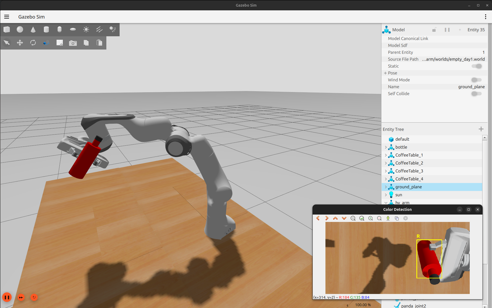

# ROS 2 Franka Panda Bottle Pick, Shake & Place

[](https://docs.ros.org/en/jazzy/)
[](https://gazebosim.org/docs/harmonic/)
[](https://moveit.picknik.ai/)
[](https://www.python.org/)

An autonomous robotic manipulation pipeline in which a simulated Franka Emika Panda detects a bottle, validates and synchronizes its position with the MoveIt Planning Scene, performs a side grasp, lifts it, executes a continuous long-stroke shaking trajectory with wrist rocking, and places it back gently.

> **Current status:** the complete upright-bottle pick–shake–place task works in simulation. Imitation learning, VLA control, arbitrary-pose grasping, and real-hardware deployment are planned work and are not part of the current implementation.



## Demo


https://github.com/user-attachments/assets/63ce7d88-758d-4c36-a94e-1394bfcd5b73

## What the system does

1. Detects the selected bottle colour from the simulated camera feed.
2. Validates the detected coordinates against the configured robot workspace.
3. Synchronizes the vision-derived bottle position with MoveIt's collision world.
4. Plans a collision-aware pre-grasp and Cartesian side approach.
5. Confirms both Gazebo physical attachment and MoveIt collision attachment.
6. Lifts the bottle vertically and generates one continuous shaking trajectory.
7. Executes vertical and horizontal strokes with continuous wrist rocking.
8. Returns the bottle to its original position using a slow final descent.
9. Detaches, opens the gripper, retreats, and returns the arm home.

## System architecture



## Key engineering features

- ROS 2 Jazzy and Gazebo Harmonic simulation.
- MoveIt 2 collision-aware joint-space and Cartesian planning.
- Vision-to-Planning-Scene synchronization to prevent stale bottle geometry.
- Workspace validation before motion planning.
- Explicit Allowed Collision Matrix updates for intentional grasp and placement contacts.
- Independent verification of Gazebo and MoveIt bottle attachment states.
- A 192-waypoint two-stage shake: three vertical cycles followed by three horizontal cycles.
- Continuous wrist rocking of up to ±45° during translation.
- Trajectory fraction, timestamp, action-result, and controller-state checks.
- Fail-fast task sequencing and slow final placement for safer execution.

## Media

| Perception | Grasp and lift |
|---|---|
|  |  |

| Continuous shake | Complete run |
|---|---|
|  |

## ROS 2 packages

| Package | Responsibility |
|---|---|
| `hv_arm` | Panda description, meshes, sensors, Gazebo world, bridges, and simulation launch |
| `hv_controller` | ROS 2 controller configuration and controller-side utilities |
| `hv_manipulation` | Bottle pick, attachment, shake, placement, and task-state logic |
| `moveit_config` | SRDF, kinematics, joint limits, controllers, planners, and RViz configuration |
| `panda_vision` | OpenCV colour detection and bottle-coordinate publication |
| `pymoveit2` | Vendored Python interface used to communicate with MoveIt 2 |

## Repository structure

```text
.
├── docs/
│   ├── media/
│   └── Franka_Panda_Bottle_Shake_Engineering_Handbook.pdf
├── src/
│   ├── hv_arm/
│   ├── hv_controller/
│   ├── hv_manipulation/
│   ├── moveit_config/
│   ├── panda_vision/
│   └── pymoveit2/
├── .gitignore
└── README.md
```

The generated ROS workspace directories `build/`, `install/`, and `log/` are intentionally excluded from version control.

## Tested environment

- Ubuntu 24.04 LTS
- ROS 2 Jazzy Jalisco
- Gazebo Harmonic
- MoveIt 2
- Python 3.12

## Installation

Install ROS 2 Jazzy and Gazebo Harmonic first. Then clone and install package dependencies:

```bash
git clone https://github.com/Harivathsha/Pick-and-Place-Simulation-using-MoveIt-Opencv-and-pymoveit2.git
cd Pick-and-Place-Simulation-using-MoveIt-Opencv-and-pymoveit2

source /opt/ros/jazzy/setup.bash
rosdep update
rosdep install --from-paths src --ignore-src -r -y

colcon build --symlink-install
source install/setup.bash
```

If `rosdep` has never been initialized on the machine, run `sudo rosdep init` once before `rosdep update`.

## Running the simulation

Open four terminals. In every terminal, enter the repository and source ROS plus the workspace:

```bash
cd ~/Pick-and-Place-Simulation-using-MoveIt-Opencv-and-pymoveit2
source /opt/ros/jazzy/setup.bash
source install/setup.bash
```

### Terminal 1 — Gazebo simulation

```bash
ros2 launch hv_arm launch_sim.launch.py
```

### Terminal 2 — MoveIt 2 and RViz

```bash
ros2 launch moveit_config moveit.launch.py
```

### Terminal 3 — Bottle perception

```bash
ros2 run panda_vision color_detector
```

### Terminal 4 — Pick, shake, and place task

```bash
ros2 run hv_manipulation bottle_shake_task --ros-args -p use_sim_time:=true
```

Wait until Gazebo, controllers, MoveIt, joint states, and perception are ready before starting the task node.

## Important task parameters

| Parameter | Default | Purpose |
|---|---:|---|
| `target_color` | `R` | Selects the bottle colour |
| `approach_offset` | `0.12 m` | Pre-grasp clearance along the approach direction |
| `bottle_height` | `0.20 m` | Simplified MoveIt cylinder height |
| `bottle_radius` | `0.035 m` | Simplified MoveIt cylinder radius |
| `shake_horizontal_amplitude` | `0.12 m` | Horizontal displacement from the lifted centre |
| `shake_vertical_amplitude` | `0.15 m` | Vertical displacement from the lifted centre |
| `shake_cycles` | `3` | Complete strokes in each shake stage |
| `shake_samples_per_cycle` | `32` | Cartesian samples per cycle |
| `shake_wrist_rotation_degrees` | `45°` | Wrist-rock amplitude |
| `shake_time_scale` | `0.55` | Simulation-only trajectory timing compression |
| `place_clearance` | `0.06 m` | Height of the slow final placement segment |

The aggressive shake and timing-compression settings were tuned for simulation. They must not be transferred directly to physical hardware without dynamic-limit, payload, collision, and safety validation.

## Engineering evolution

| Version | Main approach | Reason for the next revision |
|---|---|---|
| V1 | Four separately planned X-pattern corner motions | Replanning and stopping at every corner produced a visibly discontinuous shake |
| V2 | One continuous 128-waypoint figure-eight | Improved continuity, but the requested final behaviour required longer, faster directional strokes and wrist motion |
| V3 | One continuous 192-waypoint vertical/horizontal trajectory with wrist rocking | Current implementation; adds validated timing compression and endpoint settling |

The complete function maps, geometry calculations, trajectory equations, error history, and V1→V3 design decisions are documented in the [engineering handbook](docs/Franka_Panda_Bottle_Shake_Engineering_Handbook.pdf).

## Limitations

- The demonstrated grasp assumes an upright bottle on a known table.
- The perception pipeline uses colour-based detection rather than general 6D pose estimation.
- Gazebo attachment behaves like a rigid constraint and does not model realistic grasp slip.
- The task uses a fixed side-grasp orientation and calibrated offsets.
- Recovery after every possible partial failure is not yet automatic.
- The project has been validated in simulation, not on physical hardware.

## Roadmap — planned, not yet implemented

- Randomized bottle position, size, and orientation, including lying bottles.
- 6D pose estimation and grasp-candidate selection.
- Contact-, force-, and slip-aware grasp validation.
- Demonstration recording and imitation learning for manipulation skills.
- Reinforcement-learning fine-tuning for robustness to scene variation.
- Vision-Language-Action control for natural-language task specification and semantic scene reasoning.
- Sim-to-real transfer and deployment on a physical 6- or 7-DOF manipulator.
- Automated recovery, reset, and experiment evaluation tools.

## Documentation and attribution

- Preserve all package-level `LICENSE` files and license declarations.
- `src/pymoveit2` is a vendored third-party component and retains its own upstream license.
- Do not describe planned imitation-learning or VLA features as completed results.
- Before applying a single license to the entire repository, verify the licenses and provenance of every included model, mesh, package, and third-party component.

## Author

**Harivathsha Ramesh**  
Robotics, ROS 2, motion planning, and learning-based manipulation  
[GitHub](https://github.com/Harivathsha)

